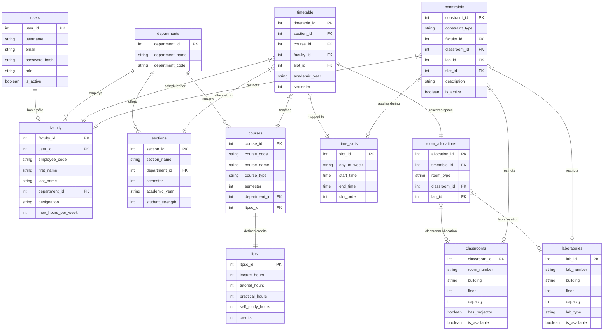
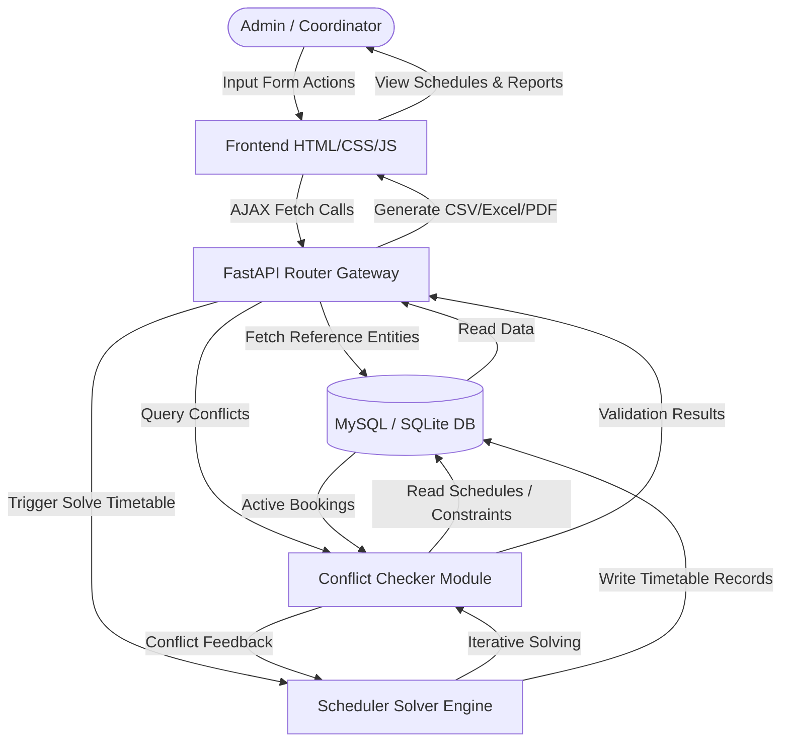
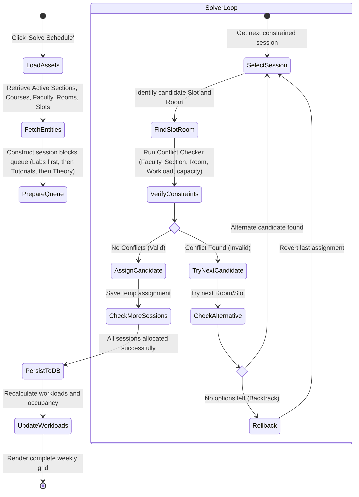
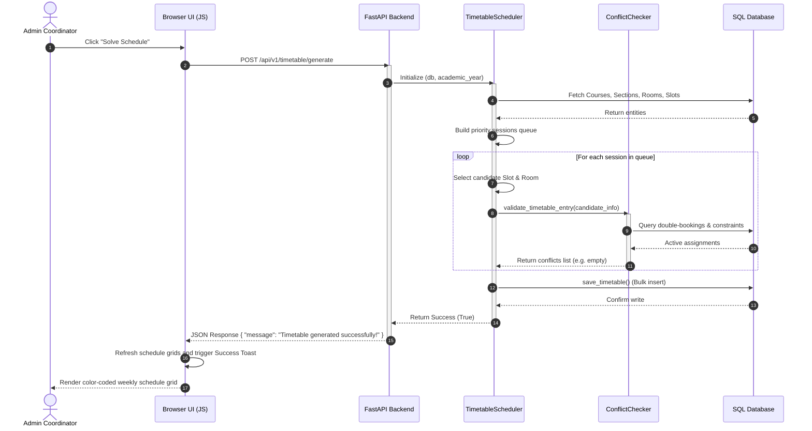
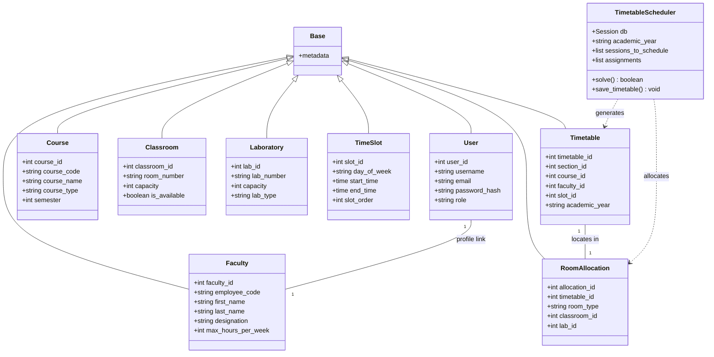

# System Architecture & UML Diagrams
## College Timetable Allocation System

Below is the complete set of system design models, entity relationships, and architectural diagrams rendered using Mermaid.

---

## 1. Entity-Relationship Diagram (ERD)

Shows database schemas, keys, and logical relationships between tables.



---

## 2. Data Flow Diagram (DFD) - Level 1

Shows the flow of data between external entities, backend services, and database stores.



---

## 3. Use Case Diagram

Identifies actor tasks and capabilities in the system.

```mermaid
left_to_right_direction
gc[College Timetable System]
actor Admin as "Admin / HOD Coordinator"

rectangle gc {
    usecase UC1 as "Manage Reference Data (Faculty, Courses, Sections, Rooms)"
    usecase UC2 as "Assign Faculty to Courses"
    usecase UC3 as "Trigger Autogeneration Timetable Solver"
    usecase UC4 as "Review Weekly Schedule Grids"
    usecase UC5 as "Analyze Workloads & Room Utilizations"
    usecase UC6 as "Export reports (CSV, Excel, PDF)"
}

Admin --> UC1
Admin --> UC2
Admin --> UC3
Admin --> UC4
Admin --> UC5
Admin --> UC6
```

---

## 4. Activity Diagram

Visualizes the step-by-step workflow of generating a timetable.



---

## 5. Sequence Diagram

Illustrates message interactions for a timetable solving request.



---

## 6. Class Diagram

Exposes the structure of system entities and scheduler classes.


